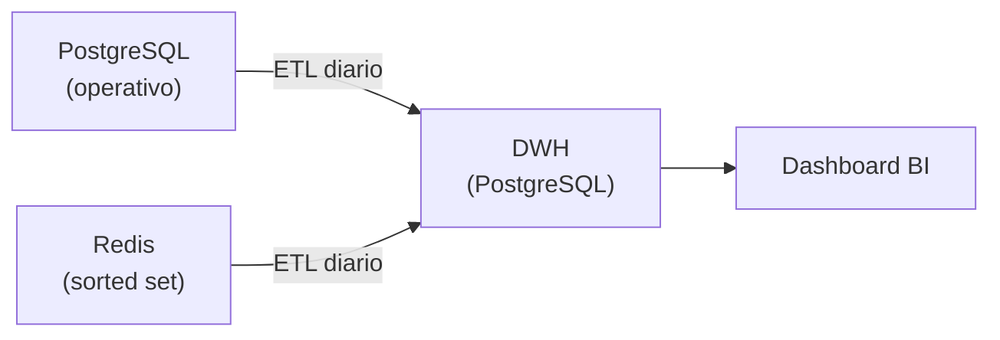
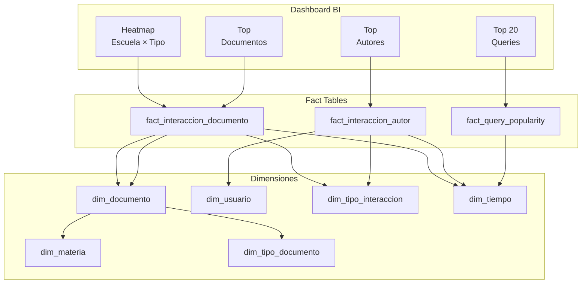

# Decisiones de Diseño — Data Warehouse Buscasam

> [!NOTE]
> Este documento resume las decisiones de diseño tomadas sobre el DWH de Buscasam, definido en "design/agregado.dbml".

---

## 1. Objetivo del DWH

El DWH alimenta un **dashboard de Business Intelligence** con 4 elementos visuales:

| # | Elemento del Dashboard | Descripción | Fuente de datos |
|---|---|---|---|
| 1 | **Heatmap Escuela/Carrera × Tipo de Documento** | Mapa de calor que cruza la estructura académica con las categorías de documentos publicados | PostgreSQL operativo |
| 2 | **Top 20 Queries Más Populares** | Ranking de los términos de búsqueda más utilizados en la plataforma | Redis (sorted set `autocomplete:queries`) |
| 3 | **Top Autores Más Prolíficos** | Ranking de autores por impacto (views + favoritos recibidos) o por cantidad de publicaciones | PostgreSQL operativo |
| 4 | **Documentos Más Vistos / Favoriteados** | Listado de documentos con mayor interacción en un período dado | PostgreSQL operativo |

---

## 2. Arquitectura General

### Metodología: Kimball (Estrella Desnormalizada)

Se adoptó el enfoque **Kimball** (modelo dimensional, estrella desnormalizada) por sobre Inmon (modelo normalizado, top-down) por las siguientes razones de negocio:

- **Alcance acotado y definido:** el DWH alimenta un dashboard con exactamente 4 elementos. No se requiere un modelo empresarial integrado ni soporte para áreas de negocio múltiples, que es donde Inmon aporta mayor valor.
- **Consultas predecibles y orientadas al rendimiento:** las queries del BI son conocidas de antemano. Kimball permite optimizar el modelo para que cada elemento del dashboard se resuelva con la menor cantidad de JOINs posible, priorizando la velocidad de lectura.
- **Desnormalización intencional:** al aplanar jerarquías (ej: Escuela > Carrera > Materia en una sola dimensión) se evitan cadenas de JOINs que un modelo normalizado Inmon requeriría, a cambio de redundancia controlada que es aceptable dado el bajo volumen de datos.
- **Simplicidad de implementación y mantenimiento:** un equipo reducido puede construir y mantener un modelo estrella con mayor facilidad que una arquitectura Inmon con su capa de integración normalizada (Enterprise Data Warehouse) y sus data marts derivados.

### DWH Polyglot — Dos Fuentes de Datos

El ETL se alimenta de dos sistemas operativos distintos:



- **PostgreSQL operativo** → pobla las dimensiones y las fact tables de interacciones (`fact_interaccion_documento`, `fact_interaccion_autor`).
- **Redis** (sorted set `autocomplete:queries`) → pobla `fact_query_popularity` mediante un snapshot diario del ranking de búsquedas.

---

## 3. Dimensiones

### dim_materia — Jerarquía Académica Desnormalizada

Aplana la jerarquía **Escuela > Carrera > Materia** en una sola tabla. Cada fila contiene los tres niveles con sus IDs y nombres, evitando JOINs para navegar la estructura académica.

- **Uso en el dashboard:** eje del heatmap (agrupar publicaciones por escuela o carrera).
- **Campos clave:** `nombre_escuela`, `nombre_carrera`, `nombre_materia`.

### dim_tiempo — Calendario Pre-poblado

Tabla de calendario con granularidad diaria, pre-poblada para todo el rango temporal del DWH.

- **Uso en el dashboard:** filtro global de período en todos los elementos.
- **Campos clave:** `fecha`, `mes`, `cuatrimestre` (1 = mar-jul, 2 = ago-dic, 0 = verano), `anio`.

### dim_usuario — Datos del Autor (SCD1)

Contiene los datos descriptivos de los usuarios/autores de la plataforma. Se usa para mostrar nombres y filtrar por carrera/escuela en el ranking de autores.

- **Uso en el dashboard:** nombre y contexto académico en el ranking de Top Autores.
- **Campos clave:** `nombre`, `nombre_carrera`, `nombre_escuela`.
- **Desnormalización:** `nombre_carrera` y `nombre_escuela` se incluyen directamente para evitar JOINs adicionales al filtrar autores por su contexto académico.

### dim_tipo_documento — Categorías de Documentos

Tabla pequeña con las categorías posibles: *tesis, paper, trabajo_practico, proyecto_investigacion, monografia, ponencia, apunte, informe_catedra*.

- **Uso en el dashboard:** eje de columnas del heatmap.

### dim_documento — Datos del Documento (SCD1)

Contiene los atributos descriptivos de cada documento publicado en la plataforma.

- **Uso en el dashboard:** título y metadatos para el listado de Top Documentos; tipo y materia para el heatmap.
- **Campos clave:** `titulo`, `fecha_alta`, `visibilidad`, `is_deleted`.
- **Soft delete:** `is_deleted` se mantiene en el DWH como filtro para excluir documentos eliminados de todos los elementos del dashboard. `deleted_at` se conserva por si se necesita analizar cuándo se eliminó un documento.

### dim_tipo_interaccion — Tipos de Acción

Tabla pequeña con los tres tipos de interacción que consume el dashboard: *publicacion, visualizacion, favorito_agregar*.

- **Uso en el dashboard:** discriminar qué se está contando en las fact tables de interacciones.

---

## 4. Tablas de Hechos

### fact_interaccion_documento

| Atributo | Detalle |
|---|---|
| **Granularidad** | Una fila por (fecha, documento, tipo_interaccion) |
| **Fuente** | PostgreSQL operativo |
| **Medida** | `cant_interacciones`: total de eventos de ese tipo sobre ese documento en ese día, sumado entre todos los usuarios |

**Alimenta:**
- **Heatmap:** filtrando por `tipo = publicacion`, JOIN a `dim_documento` → `dim_materia` para agrupar por escuela/carrera y tipo de documento.
- **Top Documentos:** filtrando por `tipo IN (visualizacion, favorito_agregar)`, JOIN a `dim_documento` para obtener títulos.

### fact_interaccion_autor

| Atributo | Detalle |
|---|---|
| **Granularidad** | Una fila por (fecha, autor, tipo_interaccion) |
| **Fuente** | PostgreSQL operativo (la resolución documento→autor(es) se hace en el ETL) |
| **Medida** | `cant_interacciones`: total de eventos de ese tipo sobre **todos los documentos** del autor en ese día |

**Alimenta:**
- **Top Autores por Impacto:** filtrando por `tipo IN (visualizacion, favorito_agregar)`, se obtiene cuánto engagement recibieron los documentos de cada autor.
- **Top Autores por Productividad:** filtrando por `tipo = publicacion`, se obtiene cuántos documentos publicó cada autor.

> [!IMPORTANT]
> La consulta para Top Autores requiere un solo JOIN a `dim_usuario`. La definición de "prolífico" (impacto vs. productividad) se controla cambiando el filtro de `id_tipo_interaccion` desde el BI, sin modificar el modelo.

### fact_query_popularity

| Atributo | Detalle |
|---|---|
| **Granularidad** | Una fila por (fecha, query_texto) |
| **Fuente** | Redis (sorted set `autocomplete:queries`) |
| **Medidas** | `score` (popularidad acumulada), `ranking` (posición en el top del día) |

**Alimenta:**
- **Top 20 Queries:** snapshot del día más reciente.
- **Evolución temporal:** seleccionar una query y graficar su posición/score a lo largo del tiempo.

`query_texto` es una **dimensión degenerada** (vive directamente en la fact table, sin tabla de dimensión separada). Esto se justifica porque el volumen es bajo (~top N queries × 365 días/año) y la consulta principal no requiere ningún JOIN.

---

## 5. Tabla de Control ETL

### etl_watermark

Registra el progreso de la carga incremental por cada tabla fuente del operativo.

| Campo | Descripción |
|---|---|
| `tabla_origen` | Nombre de la tabla fuente en el sistema operativo |
| `ultimo_procesado` | Timestamp más reciente de los registros ya cargados (marca de agua, leída del operativo) |
| `ultima_corrida` | Fecha/hora de la última ejecución del ETL para esa tabla |

El dashboard puede usar `ultima_corrida` para mostrar un indicador de frescura de datos.

---

## 6. Decisiones de Diseño Clave

### 6.1. Eliminación del Bridge Documento↔Autor

**Decisión:** se eliminó la tabla `bridge_documento_autor` del DWH.

**Motivo:** la relación N:M entre documentos y autores se resuelve en el **ETL** al momento de la carga, usando los datos del operativo. El resultado pre-agregado se almacena en `fact_interaccion_autor`. Ningún elemento del dashboard necesita navegar de documento a autor (o viceversa) en tiempo de consulta.

> [!NOTE]
> La relación N:M sigue existiendo en la base operativa. Si en el futuro el dashboard necesitara cruzar documentos con autores (ej: *"¿quiénes son los autores del documento más visto?"*), se podría reintroducir el bridge.

### 6.2. Dos Fact Tables de Interacciones en vez de Una

**Decisión:** mantener `fact_interaccion_documento` y `fact_interaccion_autor` como tablas separadas, aunque ambas se alimentan de los mismos eventos fuente.

**Motivo:** tienen **granos distintos** (documento-céntrico vs. autor-céntrico). Unificarlas en una sola tabla con ambas claves `(fecha, id_documento, id_usuario, tipo)` introduce el problema de la relación N:M: si un documento tiene 2 coautores, cada interacción genera 2 filas, lo que **infla los conteos** al agrupar por documento. Mantenerlas separadas garantiza que cada consulta del dashboard obtenga valores correctos sin lógica compensatoria.

### 6.3. Dimensión Degenerada para Queries

**Decisión:** `query_texto` se almacena directamente en `fact_query_popularity` como dimensión degenerada, sin una `dim_query` separada.

**Motivo:** el volumen de datos es bajo (top N queries por día), la consulta principal del dashboard es un simple `SELECT ... ORDER BY ranking LIMIT 20` sin JOINs, y no hay necesidad de agregar atributos descriptivos a las queries. Si en el futuro se quisiera categorizar o enriquecer las queries, se podría migrar a una dimensión propia.

### 6.4. Datos Operativos en las Dimensiones

Se incluyen en el DWH solo los campos operativos que tienen **valor analítico** como filtro o atributo descriptivo:

| Campo | ¿En el DWH? | Justificación |
|---|---|---|
| `fecha_alta` | ✅ Sí | Atributo descriptivo útil para filtrar documentos por antigüedad |
| `visibilidad` | ✅ Sí | Permite filtrar por nivel de acceso (público/interno/privado) |
| `is_deleted` | ✅ Sí | Filtro necesario para excluir documentos eliminados del dashboard |
| `deleted_at` | ✅ Sí | Permite analizar temporalidad de las eliminaciones |

---

## 7. Flujo ETL — Pseudocódigo

### Carga de fact_interaccion_documento

```sql
-- Desde el operativo: agrupar eventos por (día, documento, tipo)
SELECT
    DATE(i.timestamp)    AS fecha,
    i.documento_id       AS id_documento,
    i.tipo               AS id_tipo_interaccion,
    COUNT(*)             AS cant_interacciones
FROM interacciones i
WHERE i.timestamp > :watermark
GROUP BY DATE(i.timestamp), i.documento_id, i.tipo;
-- UPSERT en fact_interaccion_documento
```

### Carga de fact_interaccion_autor

```sql
-- Desde el operativo: resolver la coautoría y agrupar por (día, autor, tipo)
SELECT
    DATE(i.timestamp)    AS fecha,
    da.usuario_id        AS id_usuario,
    i.tipo               AS id_tipo_interaccion,
    COUNT(*)             AS cant_interacciones
FROM interacciones i
JOIN documento_autores da ON da.documento_id = i.documento_id
WHERE i.timestamp > :watermark
GROUP BY DATE(i.timestamp), da.usuario_id, i.tipo;
-- UPSERT en fact_interaccion_autor
```

> [!IMPORTANT]
> En el caso de coautoría, un mismo evento (ej: una visualización de un documento con 2 autores) genera una fila por autor en `fact_interaccion_autor`. Esto es intencional: ambos autores reciben el crédito de impacto. En `fact_interaccion_documento`, el mismo evento genera una sola fila (agrupada por documento, sin importar cuántos autores tenga).

### Carga de fact_query_popularity

```sql
-- Desde Redis: snapshot diario del sorted set
ZREVRANGE autocomplete:queries 0 N WITHSCORES
-- Para cada (query_texto, score), asignar ranking e insertar en fact_query_popularity
```

---

## 8. Mapa de Navegación: Dashboard → Tablas



| Elemento | Fact Table | JOINs Necesarios | Filtro en dim_tipo_interaccion |
|---|---|---|---|
| Heatmap | `fact_interaccion_documento` | `dim_documento` → `dim_materia` + `dim_tipo_documento` (2 JOINs) | `publicacion` |
| Top Queries | `fact_query_popularity` | Ninguno (dimensión degenerada) | N/A |
| Top Autores | `fact_interaccion_autor` | `dim_usuario` (1 JOIN) | `visualizacion` + `favorito_agregar` (impacto) o `publicacion` (productividad) |
| Top Documentos | `fact_interaccion_documento` | `dim_documento` (1 JOIN) | `visualizacion` + `favorito_agregar` |
