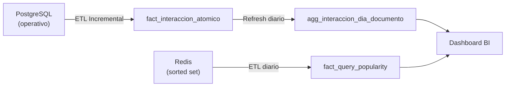
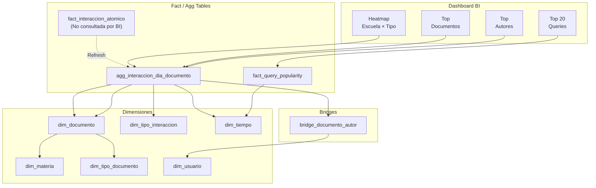

# Decisiones de Diseño — Data Warehouse Buscasam (Modelo Transaccional)

> [!NOTE]
> Este documento resume las decisiones de diseño tomadas sobre el DWH de Buscasam, definido en "design/transaccional.dbml". Este modelo implementa un patrón "Atómico + Agregado" (Patrón C).

---

## 1. Objetivo del DWH

El DWH alimenta un **dashboard de Business Intelligence** con 4 elementos visuales:

| # | Elemento del Dashboard | Descripción | Fuente de datos |
|---|---|---|---|
| 1 | **Heatmap Escuela/Carrera × Tipo de Documento** | Mapa de calor que cruza la estructura académica con las categorías de documentos publicados | PostgreSQL operativo |
| 2 | **Top 20 Queries Más Populares** | Ranking de los términos de búsqueda más utilizados en la plataforma | Redis (sorted set `autocomplete:queries`) |
| 3 | **Top Autores Más Prolíficos** | Ranking de autores por impacto (views + favoritos recibidos) o por cantidad de publicaciones | PostgreSQL operativo |
| 4 | **Documentos Más Vistos / Favoriteados** | Listado de documentos con mayor interacción en un período dado | PostgreSQL operativo |

---

## 2. Arquitectura General

### Metodología: Modelo Dimensional con Patrón C (Atómico + Agregado)

Se adoptó un modelo dimensional en estrella, pero manteniendo el detalle a nivel transaccional (atómico) y proveyendo capas de agregación:

- **Fuente de Verdad Atómica:** La tabla de hechos principal (`fact_interaccion_atomico`) registra cada evento individual (grano = 1 interacción), manteniendo el timestamp exacto y el usuario que realizó la acción.
- **Vista Materializada (Agregada):** Para optimizar las consultas del dashboard, se utiliza `agg_interaccion_dia_documento`, la cual consolida los eventos a nivel diario por documento.
- **Sin Historicidad (SCD1):** Las dimensiones reflejan el estado actual (Tipo 1). No se preservan los cambios históricos en el DWH (SCD2) por una decisión de alcance del TPI.
- **Desnormalización intencional:** Al igual que en el modelo puramente agregado, se aplanan jerarquías (ej: Escuela > Carrera > Materia) para evitar JOINs innecesarios.

### DWH Polyglot — Dos Fuentes de Datos

El ETL se alimenta de dos sistemas operativos distintos:



---

## 3. Dimensiones

### dim_materia — Jerarquía Académica Desnormalizada

Aplana la jerarquía **Escuela > Carrera > Materia** en una sola tabla.
- **Uso en el dashboard:** eje del heatmap (agrupar publicaciones por escuela o carrera).
- **Campos clave:** `nombre_escuela`, `nombre_carrera`, `nombre_materia`.

### dim_tiempo — Calendario Pre-poblado

Tabla de calendario con granularidad diaria, pre-poblada para todo el rango temporal del DWH.
- **Uso en el dashboard:** filtro global de período en todos los elementos.
- **Campos clave:** `fecha`, `dia`, `mes`, `cuatrimestre`, `anio`.

### dim_usuario — Datos del Usuario (SCD1)

Contiene los datos descriptivos de los usuarios de la plataforma (ya sea que actúen como autores o interactúen con contenido).
- **Uso en el dashboard:** nombre y contexto académico en el ranking de Top Autores.
- **Campos clave:** `nombre`, `nombre_carrera`, `nombre_escuela` (desnormalizados para evitar JOINs adicionales).

### dim_tipo_documento — Categorías de Documentos

Tabla pequeña con las categorías posibles: *tesis, paper, trabajo_practico, proyecto_investigacion, monografia, ponencia, apunte, informe_catedra*.

### dim_documento — Datos del Documento (SCD1)

Contiene los atributos descriptivos de cada documento publicado en la plataforma.
- **Campos clave:** `titulo`, `fecha_alta`, `visibilidad`, `is_deleted`.
- **Soft delete:** `is_deleted` se mantiene en el DWH como filtro para excluir documentos eliminados.

### dim_tipo_interaccion — Tipos de Acción

Tabla con los tipos de interacción: *publicacion, visualizacion, favorito_agregar, favorito_quitar, descarga, comentario*.

---

## 4. Bridge Tables

### bridge_documento_autor

A diferencia del modelo puramente agregado, este esquema conserva la relación N:M original entre documentos y autores mediante una tabla puente.

- **Granularidad:** Una fila por relación documento-autor.
- **Uso en el dashboard:** Necesaria para calcular el ranking de autores, ya que permite navegar desde la vista materializada de documentos (`agg_interaccion_dia_documento`) hacia los autores correspondientes en tiempo de consulta.

---

## 5. Tablas de Hechos y Agregaciones

### fact_interaccion_atomico (Fuente de Verdad)

| Atributo | Detalle |
|---|---|
| **Granularidad** | 1 fila = 1 evento individual |
| **Fuente** | PostgreSQL operativo |
| **Medida** | Cada fila es una ocurrencia (no requiere conteo en la carga) |
| **Temporalidad** | Preserva `timestamp_evento` para precisión intra-día y `fecha` (FK a dim_tiempo) para particionado y agregaciones diarias. |

**Propósito:** No es consumida directamente por el dashboard. Soporta drill-down, análisis de secuencias de eventos, sesionización y es la base inmutable de la cual se construyen los agregados.

### agg_interaccion_dia_documento (Vista Materializada)

| Atributo | Detalle |
|---|---|
| **Granularidad** | Una fila por (fecha, documento, tipo_interaccion) |
| **Origen** | Derivada de `fact_interaccion_atomico` |
| **Medida** | `cant_interacciones` (COUNT de los eventos atómicos para esa combinación) |

**Alimenta:**
- **Heatmap:** cruzando con documento, materia y tipo de documento.
- **Top Documentos:** sumando las interacciones por documento.
- **Top Autores:** cruzando con `bridge_documento_autor` para repartir interacciones o publicaciones a sus respectivos autores.

### fact_query_popularity

| Atributo | Detalle |
|---|---|
| **Granularidad** | Una fila por (fecha, query_texto) |
| **Fuente** | Redis |
| **Medidas** | `score` (popularidad acumulada), `ranking` (posición en el top) |

Usa `query_texto` como dimensión degenerada. Alimenta el elemento **Top 20 Queries**.

---

## 6. Tabla de Control ETL

### etl_watermark

Registra el progreso de la carga incremental hacia `fact_interaccion_atomico`.
- **Campos clave:** `tabla_origen`, `ultimo_procesado` (marca de agua), `ultima_corrida`.

---

## 7. Decisiones de Diseño Clave

### 7.1. Implementación del Patrón "Atómico + Agregado"

**Decisión:** Mantener el grano más bajo posible (evento individual) en la tabla principal y usar vistas agregadas (`agg_interaccion_dia_documento`) para el BI.

**Motivo:** Flexibilidad a futuro. El modelo puramente agregado destruye la dimensión temporal intra-día y la posibilidad de saber *qué* usuario realizó la acción sobre *qué* documento. Con este modelo, el dashboard consulta rápido mediante la vista agregada, pero se preservan los datos granulares para futuros casos de uso (ej: algoritmos de recomendación, detección de anomalías, métricas de sesión).

### 7.2. Preservación del Bridge Documento↔Autor

**Decisión:** Se mantiene la tabla `bridge_documento_autor`.

**Motivo:** Como la vista materializada consolida interacciones por *documento* (no por autor), para poder calcular los "Top Autores Más Prolíficos" en el dashboard es necesario cruzar las interacciones del documento con sus respectivos autores en tiempo de consulta.

### 7.3. Doble marca temporal en fact_interaccion_atomico

**Decisión:** Coexisten `fecha` (FK a dim_tiempo) y `timestamp_evento`.

**Motivo:** `fecha` permite usar las ventajas del modelo dimensional (JOIN limpio con dimensiones de calendario y agregaciones diarias), mientras que `timestamp_evento` conserva la precisión sub-diaria de la ocurrencia para análisis fino.

### 7.4. Sin histórico (SCD Tipo 1)

**Decisión:** Las dimensiones se sobreescriben ante cambios (no hay SCD2).

**Motivo:** Alcance acotado del TPI. No se requiere soporte para rastrear la historia de cambios en el contexto de los usuarios o documentos.

---

## 8. Flujo ETL — Pseudocódigo

### Carga de fact_interaccion_atomico (Incremental)

```sql
-- Insertar nuevos eventos desde la última marca de agua
INSERT INTO fact_interaccion_atomico (fecha, timestamp_evento, id_documento, id_usuario, id_tipo_interaccion)
SELECT 
    DATE(i.timestamp), 
    i.timestamp, 
    i.documento_id, 
    i.usuario_id, 
    i.tipo
FROM interacciones i
WHERE i.timestamp > :watermark;
-- Actualizar etl_watermark
```

### Refresh de agg_interaccion_dia_documento

```sql
-- Actualizar la vista materializada usando la data fresca
TRUNCATE agg_interaccion_dia_documento;

INSERT INTO agg_interaccion_dia_documento (fecha, id_documento, id_tipo_interaccion, cant_interacciones)
SELECT fecha, id_documento, id_tipo_interaccion, COUNT(*)
FROM fact_interaccion_atomico
GROUP BY 1, 2, 3;
```

### Carga de fact_query_popularity

```sql
-- Snapshot diario del sorted set desde Redis
ZREVRANGE autocomplete:queries 0 N WITHSCORES
-- Para cada tupla devuelta, calcular ranking e insertar en fact_query_popularity
```

---

## 9. Mapa de Navegación: Dashboard → Tablas



| Elemento | Fact Table / Agg | JOINs Necesarios |
|---|---|---|
| Heatmap | `agg_interaccion_dia_documento` | `dim_documento` → `dim_materia` + `dim_tipo_documento` (2 JOINs) |
| Top Queries | `fact_query_popularity` | Ninguno (dimensión degenerada) |
| Top Autores | `agg_interaccion_dia_documento` | `bridge_documento_autor` → `dim_usuario` (2 JOINs) |
| Top Documentos | `agg_interaccion_dia_documento` | `dim_documento` (1 JOIN) |
