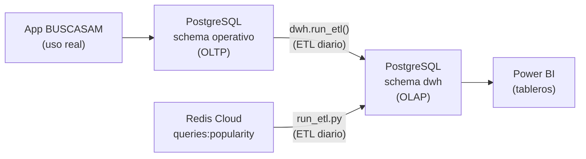
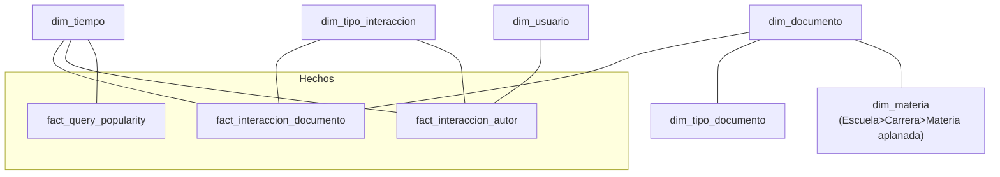
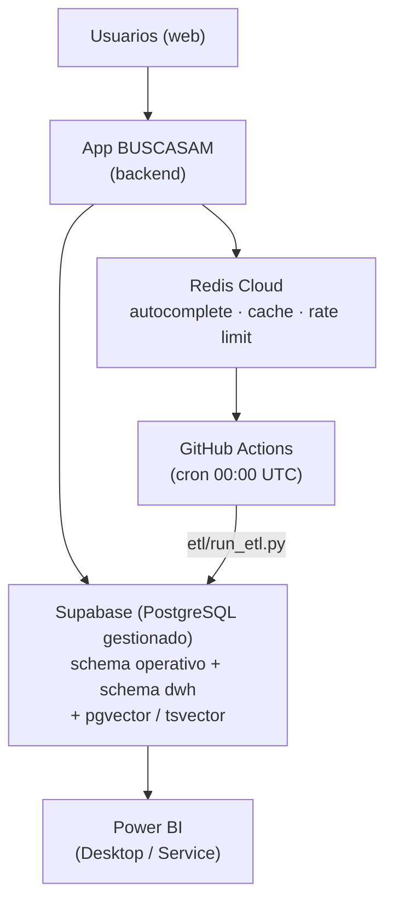

# BUSCASAM — Trabajo Práctico Integrador de Base de Datos

## Presentación del Escenario
La comunidad universitaria de UNSAM no cuenta con una plataforma centralizada para acceder a su producción académica (tesis, papers, trabajos prácticos, proyectos de investigación, etc.). El material está disperso entre cátedras, carreras y repositorios personales, y los buscadores existentes solo encuentran coincidencias exactas de palabras, sin entender lo que el usuario realmente quiso buscar.

## Empresa
La Universidad Nacional de San Martín (UNSAM) es una institución académica pública organizada en Escuelas, Carreras y Materias. Los usuarios del sistema serán estudiantes y docentes de la institución, que ingresarán con su cuenta institucional, junto con invitados externos que podrán consultar contenido público sin registrarse.

## Situación a Implementar/Solucionar
Se desarrollará BUSCASAM, una aplicación web de búsqueda académica inspirada en Google Scholar Labs. El buscador entenderá el significado de la consulta y además detectará las palabras exactas que escribió el usuario, trabajando sobre un conjunto de documentos cargados por la propia comunidad. Incluirá un formulario guiado para publicar trabajos, donde el autor cargará algunos datos básicos y el sistema extraerá automáticamente el resumen, las palabras clave y la fecha, permitiendo además sumar co-autores, mantener un historial de versiones del archivo y elegir quién puede ver cada trabajo (público, solo UNSAM o privado). Se sumarán filtros por fecha, área y tipo de documento, autocompletado, sugerencias cuando no haya resultados y la opción de ordenar por más recientes. Cada usuario verá recomendaciones personalizadas y trabajos relacionados, sin que esto afecte el orden de los resultados de búsqueda, para que dos personas distintas obtengan lo mismo ante la misma consulta. Finalmente, habrá favoritos, comentarios con respuestas, navegación por Escuela, tipo y autor y un sistema de reportes que cualquier docente puede revisar para ocultar contenido inadecuado, con registro de cada acción y posibilidad de apelar.

## Justificación
Centralizar la producción académica reduce la dificultad para encontrarla y visibiliza trabajos que hoy quedan fuera del alcance de su cátedra de origen. Entender el significado de la consulta resuelve un problema real: el usuario puede escribir "calentamiento global" y encontrar trabajos sobre "cambio climático", algo imposible con un buscador tradicional. Combinarlo con la coincidencia exacta de palabras mantiene la precisión cuando se buscan términos puntuales. Que el orden de los resultados sea igual para todos y las direcciones web sean estables permite citar y compartir búsquedas, algo necesario en un contexto académico. Publicar de forma inmediata y moderar después permite que la plataforma se llene rápido sin desalentar a quien sube su trabajo, mientras que el ingreso con cuenta institucional asegura que los permisos reflejen la estructura real de la universidad sin configuración manual.

---

## Motor SQL: PostgreSQL

**Empresa/organización que lo provee.** PostgreSQL es desarrollado por la PostgreSQL Global Development Group, una comunidad internacional que sostiene el proyecto desde 1996. No depende de una sola empresa. En este TP se usa a través de **Supabase**, una plataforma que ofrece PostgreSQL gestionado en la nube.

**Justificación de la elección.** Es el motor central del sistema y concentra la mayor parte de la información. En sus tablas viven los usuarios y sus perfiles, los documentos con sus metadatos, los comentarios, los favoritos, las búsquedas y el registro de moderación. Maneja muy bien las relaciones entre tablas (un trabajo tiene varios autores, un usuario tiene muchos favoritos) y garantiza consistencia ante operaciones simultáneas. Además, gracias a sus extensiones cubre necesidades que normalmente requerirían motores adicionales:

- **pgvector**: guarda los embeddings y resuelve la mitad semántica del buscador y los "trabajos relacionados".
- **tsvector** (incluido de fábrica): implementa la búsqueda por palabras exactas o raíces en español, que aporta la otra mitad del ranking.
- La **jerarquía académica** (Escuela → Carrera → Materia) se modela con claves foráneas en la base operativa, y se aplana en una sola dimensión en el datawarehouse.

**Tipo de licencia.** Libre y gratuito (PostgreSQL License, open source; permite uso comercial, modificación y redistribución). pgvector también es open source.

**Cómo conseguirlo.** Sitio oficial: <https://www.postgresql.org/download/> (instaladores Windows/macOS/Linux, paquetes apt/yum/brew, imágenes Docker). pgvector: <https://github.com/pgvector/pgvector>, se habilita con `CREATE EXTENSION vector`. En este proyecto se usa Supabase (<https://supabase.com>), que ya provee PostgreSQL + pgvector gestionados.

## Motor NoSQL: Redis

**Empresa/organización que lo provee.** Redis es desarrollado por Redis Ltd. (fundada en 2011, EE.UU. e Israel) junto con una amplia comunidad open source. En este TP corre en **Redis Cloud** (servicio gestionado).

**Justificación de la elección.** Se usa como base auxiliar en memoria para lo que necesita responder muy rápido y no requiere persistencia estricta:

- **Autocompletado** del buscador (RediSearch, `FT.SUGADD`/`FT.SUGGET`): cada tecla debe responder en menos de un milisegundo, latencia que PostgreSQL no garantiza.
- **Popularidad de queries** (sorted set `queries:popularity`): ranking de búsquedas que sirve para el autocompletado online y que, además, **alimenta el datawarehouse** con un snapshot diario.
- **Blacklist de JWT** para logout (`SET` con TTL) y **rate limiting** por usuario (`INCR` + `EXPIRE`): contadores con expiración automática, triviales de implementar en Redis.

Su modelo clave-valor en memoria lo hace ideal para estos usos, donde perder los datos no es crítico porque se reconstruyen desde PostgreSQL.

**Tipo de licencia.** Libre (RSALv2 / SSPLv1 / AGPLv3, gratuitas para este uso). Existe Redis Enterprise (paga) con clustering y soporte avanzados, no necesarios aquí.

**Cómo conseguirlo.** Sitio oficial: <https://redis.io/download/> (paquetes Linux, Homebrew, imagen Docker oficial `redis/redis-stack`). En la nube: Redis Cloud (<https://redis.com/cloud/>).

---

## Diseño del Datawarehouse

### Arquitectura BI
La base operativa de BUSCASAM (PostgreSQL) está optimizada para consultas individuales en tiempo real (ver un trabajo, comentar, buscar). No se quiere mezclar esa carga con consultas analíticas pesadas como "¿cuáles fueron las áreas más buscadas el último cuatrimestre?". Para eso se monta un datawarehouse con un **esquema dimensional propio** (`dwh`), separado lógicamente del esquema operativo (`operativo`) dentro del mismo proyecto Supabase. La arquitectura tiene cuatro capas:

1. **Origen**: el schema `operativo` (OLTP normalizado en 3NF), donde viven los datos del día a día, y **Redis Cloud**, que aporta la popularidad de queries.
2. **Proceso ETL**: una tarea programada (GitHub Actions, diaria a las 00:00 UTC) extrae lo nuevo/modificado del operativo y de Redis, lo transforma al modelo dimensional y lo carga en el DWH. La transformación PostgreSQL→PostgreSQL vive en una función almacenada (`dwh.run_etl()`); la parte Redis→PostgreSQL, en un script Python (`etl/run_etl.py`).
3. **Datawarehouse (OLAP)**: el schema `dwh`, con su modelo dimensional (`dwh.fact_*` y `dwh.dim_*`).
4. **Visualización**: Power BI, que se conecta al DWH y permite armar tableros interactivos.



### Motor Seleccionado: PostgreSQL (schema `dwh`)
Se eligió **PostgreSQL** también para el datawarehouse, en un **schema separado** (`dwh`) del operativo, dentro del mismo proyecto Supabase. La justificación es práctica: el equipo ya domina PostgreSQL, no hay que aprender otro dialecto ni montar infraestructura paralela, y a la escala de BUSCASAM (decenas de miles de eventos) PostgreSQL responde sin problemas las consultas analíticas. La separación por schema aísla los objetos analíticos de los operativos; si en el futuro el volumen creciera, el modelo dimensional y el ETL son estándar y permiten migrar a una instancia o motor dedicado sin rehacer el trabajo.

Para la **visualización** se usa **Power BI** (Microsoft): conecta directo a PostgreSQL, modela relaciones, crea medidas con DAX y publica tableros consultables desde el navegador. Se eligió por su uso institucional, su curva de aprendizaje suave y las licencias educativas de UNSAM. Licencia **paga** (Power BI Pro, ~10 USD/usuario/mes; Power BI Desktop para autoría es gratuito), usualmente cubierta por el acuerdo institucional.

### Modelado de Datos: Estrella desnormalizada (Kimball, SCD1)
Se adoptó el enfoque **Kimball** con un **modelo en estrella desnormalizado** (SCD Tipo 1). El alcance es acotado y conocido: el DWH alimenta un dashboard con 4 elementos. Las consultas son predecibles, así que conviene optimizar el modelo para resolver cada elemento con la menor cantidad de JOINs.

La decisión central es **aplanar la jerarquía Escuela → Carrera → Materia en una sola dimensión** (`dim_materia`), en lugar de mantenerla normalizada en tres tablas (lo que sería un copo de nieve). Cada fila de `dim_materia` contiene los IDs y nombres de los tres niveles, evitando recorrer cuatro tablas para agrupar por Escuela. Esta redundancia controlada es aceptable dado el bajo volumen y simplifica las consultas del dashboard.

El modelo se compone de **tablas de hechos** (eventos cuantificables) y **dimensiones** (su contexto):

**Tablas de hechos**

| Tabla | Qué registra | Granularidad | Medida |
|---|---|---|---|
| `fact_interaccion_documento` | Interacciones sobre un documento | (fecha, documento, tipo) | `cant_interacciones` |
| `fact_interaccion_autor` | Interacciones imputadas al autor (resuelve co-autoría en el ETL) | (fecha, autor, tipo) | `cant_interacciones` |
| `fact_query_popularity` | Popularidad de queries (snapshot diario desde Redis) | (fecha, query) | `score`, `ranking` |

El "tipo" de interacción (`dim_tipo_interaccion`) es **publicacion**, **visualizacion** o **favorito_agregar**, lo que permite discriminar qué se cuenta sin cambiar el modelo. `query_texto` es una **dimensión degenerada** (vive en la propia fact, sin tabla aparte).

**Dimensiones**

| Dimensión | Contexto que aporta |
|---|---|
| `dim_tiempo` | Día, mes, cuatrimestre (1 = mar–jul, 2 = ago–dic) y año. |
| `dim_usuario` | Autor/usuario, con carrera y escuela **desnormalizadas** (SCD1). |
| `dim_documento` | Documento: título, fecha de alta, visibilidad, `is_deleted` (soft delete). Enlaza con `dim_tipo_documento` y `dim_materia` (SCD1). |
| `dim_materia` | Jerarquía Escuela > Carrera > Materia **aplanada** en una sola tabla. |
| `dim_tipo_documento` | Tesis, paper, trabajo práctico, etc. |
| `dim_tipo_interaccion` | publicacion / visualizacion / favorito_agregar. |



> **Sin tabla puente:** la relación N:M documento↔autor **no** se modela con un bridge en el DWH; se resuelve en el ETL al cargar `fact_interaccion_autor` (cada interacción de un documento con N autores genera una fila por autor). Ningún elemento del dashboard necesita navegar de documento a autor en tiempo de consulta.

Con este modelo se responden preguntas como "publicaciones por Escuela en el último año", "documentos más vistos" o "autores con más impacto".

### Infraestructura usada: Diagramas y Máquinas
La solución es **100% en la nube y gestionada**, sin servidores propios que administrar:



**Componentes:**
- **Supabase** (PostgreSQL gestionado): aloja los dos schemas (`operativo` y `dwh`), pgvector y tsvector. Sin administración de servidor; backups y escalado los provee la plataforma.
- **Redis Cloud**: instancia gestionada para autocompletado, popularidad de queries, blacklist de JWT y rate limiting.
- **GitHub Actions**: corre el ETL (`etl/run_etl.py`) todos los días a las 00:00 UTC (y bajo demanda), leyendo las credenciales desde *secrets*. Reemplaza a un cron en un servidor propio.
- **Power BI**: Desktop para autoría, Service (cloud) para consulta. Se conecta al schema `dwh`.

Para desarrollo local, Supabase CLI levanta un PostgreSQL en Docker y Redis Stack corre vía `docker-compose` (carpeta `nosql/`).

---

## Operaciones sobre el Datawarehouse

Todas las tablas viven en el schema `dwh`. Los ejemplos están implementados como scripts ejecutables en `supabase/demos_crud/`.

### Creación
El esquema se crea una sola vez al desplegar el DWH (migración `…_dwh_schema.sql`): define hechos y dimensiones con sus claves e índices. El siguiente es el patrón del hecho central y su PK compuesta:

```sql
CREATE TABLE dwh.fact_interaccion_documento (
    fecha               DATE NOT NULL REFERENCES dwh.dim_tiempo(fecha),
    id_documento        INTEGER NOT NULL REFERENCES dwh.dim_documento(id_documento),
    id_tipo_interaccion INTEGER NOT NULL REFERENCES dwh.dim_tipo_interaccion(id_tipo_interaccion),
    cant_interacciones  INTEGER NOT NULL DEFAULT 1,
    PRIMARY KEY (fecha, id_documento, id_tipo_interaccion)
);
```

**ETL — Creación.** El despliegue corre las migraciones (`supabase db push`) que crean los schemas y la función `dwh.run_etl()`. La primera corrida del ETL hace la **carga inicial completa**: prepara catálogos fijos (`dim_tipo_interaccion`, sentinel de usuario anónimo `id 0`), genera `dim_tiempo`, y carga todas las dimensiones y hechos desde el operativo y la popularidad desde Redis. A partir de ahí pasa a modo incremental.

### Eliminación
Solo se borran datos por moderación, pedido del autor (derecho al olvido) o políticas de retención. Como el modelo es SCD1 con clave natural (`id_documento`), la baja se resuelve directo por esa clave, con dos mecanismos:

```sql
-- 1) Baja lógica (lo habitual): el documento desaparece del dashboard pero queda la traza
UPDATE dwh.dim_documento
   SET is_deleted = TRUE, deleted_at = CURRENT_DATE
 WHERE id_documento = 4521;

-- 2) Purga física de los hechos (derecho al olvido)
DELETE FROM dwh.fact_interaccion_documento
 WHERE id_documento = 4521;
```

**ETL — Eliminación.** La baja lógica del operativo llega como un cambio más en la corrida incremental: el ETL detecta `is_deleted`/`deleted_at` vía `updated_at` y lo sobreescribe (SCD1). La purga física es una operación puntual fuera del flujo incremental.

### Inserción
La inserción ocurre en cada corrida del ETL. En el modelo agregado **no se inserta una fila por evento**, sino una fila por (fecha, documento, tipo) con el total del día:

```sql
INSERT INTO dwh.fact_interaccion_documento
    (fecha, id_documento, id_tipo_interaccion, cant_interacciones)
VALUES
    ('2026-05-04', 1010, 2, 27),   -- 27 visualizaciones del doc 1010
    ('2026-05-04', 1010, 3,  4),   -- 4 favoritos del doc 1010
    ('2026-05-04',  587, 2,  8)    -- 8 visualizaciones del doc 587
ON CONFLICT (fecha, id_documento, id_tipo_interaccion)
DO UPDATE SET cant_interacciones =
    dwh.fact_interaccion_documento.cant_interacciones + EXCLUDED.cant_interacciones;
```

**ETL — Inserción.** El ETL guarda en `dwh.etl_watermark` la fecha/hora del último registro procesado por tabla origen. En cada corrida: **(1) extrae** del operativo solo los eventos con `created_at > watermark` (carga incremental); **(2) transforma**, agregando los eventos por (fecha, documento, tipo) y sumando la cantidad —así N visualizaciones de un día colapsan en una fila—; **(3) carga** con `INSERT … ON CONFLICT DO UPDATE` (upsert idempotente) dentro de una transacción y actualiza el watermark.

### Actualización
El modelo usa **SCD Tipo 1** en todas las dimensiones: sobreescribe el valor en su lugar, sin historial. Es una decisión de diseño: el dashboard solo necesita el estado actual.

```sql
-- Un usuario cambia de carrera (carrera/escuela están desnormalizadas: se pisan los 3 campos)
UPDATE dwh.dim_usuario u
   SET id_carrera = c.id_carrera, nombre_carrera = c.nombre_carrera, nombre_escuela = c.nombre_escuela
FROM  (SELECT DISTINCT id_carrera, nombre_carrera, nombre_escuela
         FROM dwh.dim_materia WHERE id_carrera = 7) c
WHERE  u.id_usuario = 1500;

-- Un documento cambia de visibilidad
UPDATE dwh.dim_documento SET visibilidad = 'privado' WHERE id_documento = 1011;
```

**ETL — Actualización.** El ETL detecta cambios comparando `updated_at` del operativo contra el watermark y aplica el `UPDATE` en la misma transacción incremental. Al ser todo SCD1, no abre ni cierra versiones: pisa los campos cambiados de la fila vigente.

### Búsquedas
Consultas analíticas, ejecutadas desde Power BI o directamente en SQL.

**Búsqueda por una clave** (una sola dimensión: tiempo):

```sql
SELECT SUM(cant_interacciones) AS total_interacciones
FROM   dwh.fact_interaccion_documento
WHERE  fecha BETWEEN '2026-03-01' AND '2026-07-31';
```

Total de interacciones del primer cuatrimestre de 2026. PostgreSQL usa `idx_fact_interaccion_fecha` para leer solo el rango, sin escanear toda la tabla.

**Búsqueda por dos claves** (cruza tipo de documento y tiempo):

```sql
SELECT td.nombre AS tipo_documento, t.anio, SUM(f.cant_interacciones) AS visualizaciones
FROM   dwh.fact_interaccion_documento f
JOIN   dwh.dim_tipo_interaccion ti ON f.id_tipo_interaccion = ti.id_tipo_interaccion
                                   AND ti.nombre = 'visualizacion'
JOIN   dwh.dim_documento       d  ON f.id_documento = d.id_documento
JOIN   dwh.dim_tipo_documento  td ON d.id_tipo = td.id_tipo
JOIN   dwh.dim_tiempo          t  ON f.fecha = t.fecha
GROUP  BY td.nombre, t.anio
ORDER  BY td.nombre, t.anio;
```

Visualizaciones por tipo de documento y año. Gracias a `dim_materia` aplanada, agrupar por Escuela requiere un solo JOIN a la dimensión en vez de recorrer cuatro tablas (como sería en copo de nieve).

---

## Minería de Datos

Dos funciones dinámicas sobre el DWH, en **SQL nativo de PostgreSQL** (sin extensiones de ML), definidas en `…_dwh_mineria.sql`. Son *dinámicas* porque recalculan sobre los datos actuales según los parámetros recibidos. Detalle y salida esperada en [`mineria.md`](mineria.md).

### Función Dinámica de Segmentación
`dwh.segmentar_autores(desde, hasta, escuela)` agrupa a los autores en una **matriz volumen × impacto** (segmentación bidimensional tipo RFM). Por cada autor calcula dos ejes en el período: **volumen** = publicaciones; **impacto** = visualizaciones + favoritos recibidos (sobre `fact_interaccion_autor`). `NTILE(2)` parte cada eje por su mediana y el cruce define 4 segmentos:

| | Impacto bajo | Impacto alto |
|---|---|---|
| **Volumen alto** | Prolífico sin alcance | **Referente** |
| **Volumen bajo** | Periférico | Joya oculta |

```sql
SELECT segmento, count(*)
FROM   dwh.segmentar_autores()
GROUP  BY segmento ORDER BY 2 DESC;
```

**Uso.** Identifica "referentes" (cara visible del área), "joyas ocultas" (talento subexpuesto a potenciar), "prolíficos sin alcance" (revisar difusión) y "periféricos". Alimenta tableros de Power BI. Es dinámica: al pasar otro rango o escuela, las medianas se recalculan **sobre ese subconjunto** —un autor puede ser Referente en su escuela y Periférico a nivel global.

### Función Dinámica de Predicción
`dwh.predecir_interacciones_documento(id_documento, horizonte_meses)` predice las visualizaciones futuras de un documento por **regresión lineal** sobre su serie mensual, usando los agregados nativos `regr_slope` / `regr_intercept` / `regr_r2` (sin extensiones). Ajusta la recta `total = a + b·mes`:

- la **pendiente** clasifica la tendencia (creciente / estable / decreciente);
- `r²` indica qué tan bien la recta explica la serie (0 = ruido, 1 = lineal perfecta);
- la **proyección** = `a + b·(último_mes + horizonte)`.

```sql
SELECT * FROM dwh.predecir_interacciones_documento(1, 3);   -- doc 1, horizonte 3 meses
```

**Uso.** Sirve para alertas ("este trabajo se está apagando") o para priorizar contenido en alza en la home. Es dinámica: se reajusta por documento y horizonte en cada llamada. Para ilustrarla, el seed inyecta una tendencia marcada en los documentos **1 (creciente), 2 (decreciente) y 3 (estable)**.

---

## Dashboard BI (4 elementos de información)
El DWH alimenta un dashboard en Power BI con cuatro elementos (detalle y consultas en [`dashboard_bi.md`](dashboard_bi.md)):

1. **Heatmap Escuela/Carrera × Tipo de documento** — distribución de la producción (sobre `dim_documento` + `dim_materia`).
2. **Top 20 queries más populares** — fuente *polyglot* desde Redis (`fact_query_popularity`).
3. **Top 10 autores más vistos** — impacto por autor (`fact_interaccion_autor`).
4. **Top 10 documentos más vistos/favoriteados (últimos 30 días)** — tracción reciente (`fact_interaccion_documento`).

---

## Nota de alcance
La base operativa registra además **descargas, búsquedas y comentarios**, pero el datawarehouse **no los modela** porque ninguno de los cuatro elementos del dashboard los necesita. Quedan disponibles en el operativo para futuras métricas (ver `metricas_adicionales.md`); incorporarlos al DWH implicaría agregar las facts correspondientes y su ETL, sin cambios estructurales en el modelo actual.
