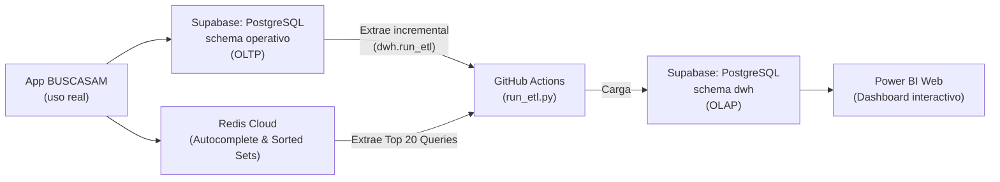
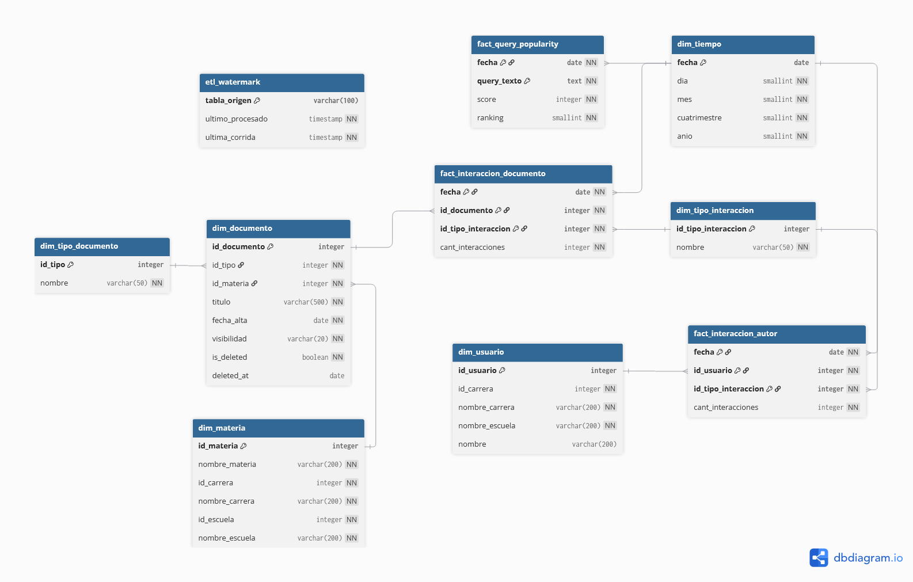
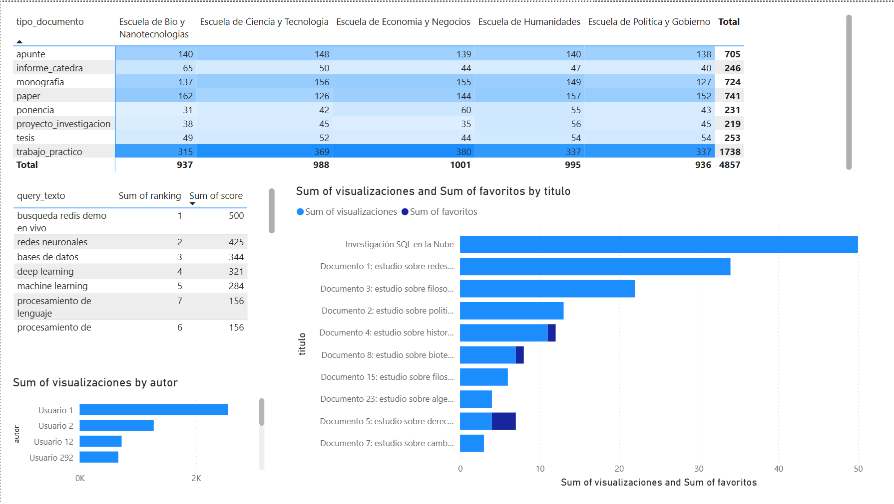
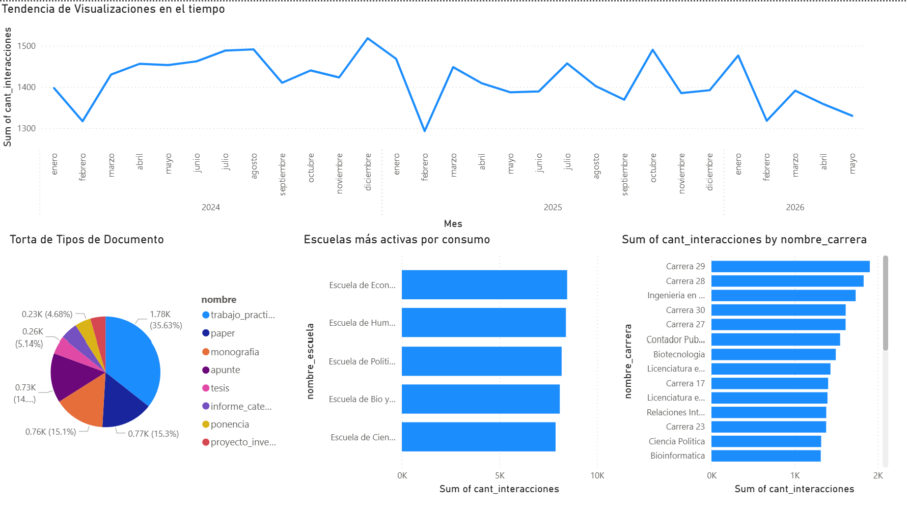

# INFORME INTEGRADOR DE BASE DE DATOS: BUSCASAM

**Grupo 3**  
**Integrantes:** Matías E. Raina, Tomás I. Nadal, Marcos Achaval, Lucas Achaval, Nicolás Cirulli  
**Repositorio GitHub:** [MarcosACH/tpi-bases-de-datos](https://github.com/MarcosACH/tpi-bases-de-datos)

---

## 1. Escenario y Arquitectura Políglota Cloud

### Presentación del Escenario
El presente trabajo, **BUSCASAM**, resuelve la dispersión de la producción académica (tesis, papers, trabajos prácticos) de la comunidad de la Universidad Nacional de San Martín (UNSAM). El sistema implementado es una plataforma web centralizada, inspirada en Google Scholar Labs, cuyo núcleo es un buscador híbrido avanzado. A diferencia de las plataformas tradicionales limitadas a la coincidencia exacta de palabras, BUSCASAM comprende el significado semántico de las consultas, al mismo tiempo que soporta búsquedas precisas por terminología exacta. El escenario se completa con un área de reportes y analítica que permite comprender cómo se consume la información académica en la institución.

### Infraestructura de Datos y Arquitectura Cloud
Para asegurar alta disponibilidad, escalabilidad y un despliegue moderno sin administración manual de servidores, toda la infraestructura técnica se desarrolló e integró **100% en la nube mediante servicios gestionados**. 

La arquitectura implementa un modelo **Políglota**, separando las responsabilidades transaccionales, de baja latencia en memoria y analíticas en los motores de base de datos más adecuados para cada carga de trabajo:

1. **Supabase (PostgreSQL Gestionado)**: Actúa como el motor principal del sistema, alojando dos esquemas lógicamente separados:
   - **Esquema `operativo` (OLTP)**: Almacena perfiles, documentos y logs. Hace un uso intensivo de `pgvector` (búsqueda semántica) y `tsvector` nativo (búsqueda léxica).
   - **Esquema `dwh` (OLAP)**: Almacena el Datawarehouse en un modelo dimensional (Estrella).
2. **Redis Cloud (NoSQL en Memoria)**: Motor auxiliar diseñado para operaciones de latencia sub-milisegundo. Contiene diccionarios tipo *Trie* utilizando el módulo **RediSearch** para autocompletado en tiempo real, y *Sorted Sets nativos* que almacenan rankings de búsquedas que alimentan posteriormente al DWH.
3. **GitHub Actions**: Actúa como el orquestador serverless ejecutando automáticamente los scripts de integración ETL diarios.
4. **Power BI Web**: Capa de visualización (Dashboard BI) que consume de forma directa el esquema `dwh`.

#### Diagrama de Flujo de Datos



## 2. Base Operativa (OLTP) y Generación de Hechos

El primer eslabón del sistema es el esquema `operativo`, una base de datos PostgreSQL normalizada en 3NF. Este esquema persiste la información central del dominio y actúa como la fuente primaria de verdad desde la cual se extraerán los datos para el Datawarehouse.
Para soportar la autoría múltiple de los trabajos, se implementó una relación N:M mediante la tabla intermedia `documento_autor`. El valor analítico radica en las tablas apend-only (`evento_visualizacion`, `favorito`, `descarga`) que capturan las interacciones de los usuarios y que luego se transformarán en tablas de hechos.

### DDL Completo del Esquema Operativo

```sql
-- =============================================================
-- BUSCASAM - Schema Operativo (OLTP)
-- =============================================================
CREATE SCHEMA IF NOT EXISTS operativo;
CREATE EXTENSION IF NOT EXISTS vector SCHEMA public;

CREATE OR REPLACE FUNCTION operativo.update_updated_at_column()
RETURNS TRIGGER AS $$
BEGIN
    NEW.updated_at = now();
    RETURN NEW;
END;
$$ LANGUAGE plpgsql;

CREATE TABLE IF NOT EXISTS operativo.escuela (
    id         SERIAL PRIMARY KEY,
    nombre     VARCHAR(200) NOT NULL,
    created_at TIMESTAMPTZ NOT NULL DEFAULT now(),
    updated_at TIMESTAMPTZ NOT NULL DEFAULT now()
);
CREATE TRIGGER update_escuela_updated_at BEFORE UPDATE ON operativo.escuela FOR EACH ROW EXECUTE FUNCTION operativo.update_updated_at_column();

CREATE TABLE IF NOT EXISTS operativo.carrera (
    id         SERIAL PRIMARY KEY,
    id_escuela INTEGER NOT NULL REFERENCES operativo.escuela(id) ON DELETE RESTRICT,
    nombre     VARCHAR(200) NOT NULL,
    created_at TIMESTAMPTZ NOT NULL DEFAULT now(),
    updated_at TIMESTAMPTZ NOT NULL DEFAULT now()
);
CREATE INDEX IF NOT EXISTS idx_carrera_escuela ON operativo.carrera(id_escuela);
CREATE TRIGGER update_carrera_updated_at BEFORE UPDATE ON operativo.carrera FOR EACH ROW EXECUTE FUNCTION operativo.update_updated_at_column();

CREATE TABLE IF NOT EXISTS operativo.materia (
    id         SERIAL PRIMARY KEY,
    id_carrera INTEGER NOT NULL REFERENCES operativo.carrera(id) ON DELETE RESTRICT,
    nombre     VARCHAR(200) NOT NULL,
    created_at TIMESTAMPTZ NOT NULL DEFAULT now(),
    updated_at TIMESTAMPTZ NOT NULL DEFAULT now()
);
CREATE INDEX IF NOT EXISTS idx_materia_carrera ON operativo.materia(id_carrera);
CREATE TRIGGER update_materia_updated_at BEFORE UPDATE ON operativo.materia FOR EACH ROW EXECUTE FUNCTION operativo.update_updated_at_column();

CREATE TABLE IF NOT EXISTS operativo.usuario (
    id         SERIAL PRIMARY KEY,
    email      VARCHAR(255) NOT NULL UNIQUE CHECK (email ~* '^[A-Z0-9._%-]+@[A-Z0-9.-]+\.[A-Z]{2,4}$'),
    nombre     VARCHAR(200) NOT NULL,
    rol        VARCHAR(20) NOT NULL CHECK (rol IN ('estudiante', 'docente')),
    id_carrera INTEGER REFERENCES operativo.carrera(id) ON DELETE SET NULL,
    created_at TIMESTAMPTZ NOT NULL DEFAULT now(),
    updated_at TIMESTAMPTZ NOT NULL DEFAULT now()
);
CREATE INDEX IF NOT EXISTS idx_usuario_carrera ON operativo.usuario(id_carrera);
CREATE TRIGGER update_usuario_updated_at BEFORE UPDATE ON operativo.usuario FOR EACH ROW EXECUTE FUNCTION operativo.update_updated_at_column();

CREATE TABLE IF NOT EXISTS operativo.tipo_documento (
    id     SERIAL PRIMARY KEY,
    nombre VARCHAR(50) NOT NULL UNIQUE
);

CREATE TABLE IF NOT EXISTS operativo.documento (
    id              SERIAL PRIMARY KEY,
    titulo          VARCHAR(500) NOT NULL,
    abstract        TEXT,
    texto_completo  TEXT,
    visibilidad     VARCHAR(20) NOT NULL CHECK (visibilidad IN ('publico', 'interno', 'privado')),
    id_tipo         INTEGER NOT NULL REFERENCES operativo.tipo_documento(id) ON DELETE RESTRICT,
    id_materia      INTEGER NOT NULL REFERENCES operativo.materia(id) ON DELETE RESTRICT,
    id_uploader     INTEGER NOT NULL REFERENCES operativo.usuario(id) ON DELETE RESTRICT,
    archivo_url     TEXT,
    
    embedding       public.vector(384),
    texto_busqueda  tsvector GENERATED ALWAYS AS (
                        to_tsvector('spanish',
                            coalesce(titulo, '') || ' ' || coalesce(abstract, '') || ' ' || coalesce(texto_completo, '')
                        )
                    ) STORED,
                    
    deleted_at      TIMESTAMPTZ,
    created_at      TIMESTAMPTZ NOT NULL DEFAULT now(),
    updated_at      TIMESTAMPTZ NOT NULL DEFAULT now()
);

CREATE INDEX IF NOT EXISTS idx_documento_materia_activo ON operativo.documento(id_materia) WHERE deleted_at IS NULL;
CREATE INDEX IF NOT EXISTS idx_documento_tipo_activo    ON operativo.documento(id_tipo) WHERE deleted_at IS NULL;
CREATE INDEX IF NOT EXISTS idx_documento_uploader       ON operativo.documento(id_uploader);
CREATE INDEX IF NOT EXISTS idx_documento_embedding_hnsw ON operativo.documento USING hnsw (embedding public.vector_cosine_ops);
CREATE INDEX IF NOT EXISTS idx_documento_texto_busqueda_gin ON operativo.documento USING gin (texto_busqueda);

CREATE TRIGGER update_documento_updated_at BEFORE UPDATE ON operativo.documento FOR EACH ROW EXECUTE FUNCTION operativo.update_updated_at_column();

CREATE TABLE IF NOT EXISTS operativo.documento_autor (
    id_documento INTEGER NOT NULL REFERENCES operativo.documento(id) ON DELETE CASCADE,
    id_usuario   INTEGER NOT NULL REFERENCES operativo.usuario(id) ON DELETE RESTRICT,
    orden        SMALLINT NOT NULL CHECK (orden >= 1),
    PRIMARY KEY (id_documento, id_usuario)
);
CREATE INDEX IF NOT EXISTS idx_doc_autor_usuario ON operativo.documento_autor(id_usuario);

CREATE TABLE IF NOT EXISTS operativo.favorito (
    id_usuario   INTEGER NOT NULL REFERENCES operativo.usuario(id) ON DELETE CASCADE,
    id_documento INTEGER NOT NULL REFERENCES operativo.documento(id) ON DELETE CASCADE,
    created_at   TIMESTAMPTZ NOT NULL DEFAULT now(),
    PRIMARY KEY (id_usuario, id_documento)
);
CREATE INDEX IF NOT EXISTS idx_favorito_documento ON operativo.favorito(id_documento);

CREATE TABLE IF NOT EXISTS operativo.evento_visualizacion (
    id           BIGSERIAL PRIMARY KEY,
    id_usuario   INTEGER REFERENCES operativo.usuario(id) ON DELETE SET NULL,
    id_documento INTEGER NOT NULL REFERENCES operativo.documento(id) ON DELETE CASCADE,
    created_at   TIMESTAMPTZ NOT NULL DEFAULT now()
);
CREATE INDEX IF NOT EXISTS idx_evento_vis_created   ON operativo.evento_visualizacion(created_at);
CREATE INDEX IF NOT EXISTS idx_evento_vis_documento ON operativo.evento_visualizacion(id_documento);

CREATE TABLE IF NOT EXISTS operativo.descarga (
    id           BIGSERIAL PRIMARY KEY,
    id_usuario   INTEGER REFERENCES operativo.usuario(id) ON DELETE SET NULL,
    id_documento INTEGER NOT NULL REFERENCES operativo.documento(id) ON DELETE CASCADE,
    created_at   TIMESTAMPTZ NOT NULL DEFAULT now()
);

CREATE TABLE IF NOT EXISTS operativo.comentario (
    id                  BIGSERIAL PRIMARY KEY,
    id_usuario          INTEGER NOT NULL REFERENCES operativo.usuario(id) ON DELETE CASCADE,
    id_documento        INTEGER NOT NULL REFERENCES operativo.documento(id) ON DELETE CASCADE,
    id_comentario_padre BIGINT REFERENCES operativo.comentario(id) ON DELETE CASCADE,
    texto               TEXT NOT NULL CHECK (char_length(texto) <= 2000),
    esta_oculto         BOOLEAN NOT NULL DEFAULT FALSE,
    fecha_oculto        TIMESTAMPTZ,
    created_at          TIMESTAMPTZ NOT NULL DEFAULT now(),
    updated_at          TIMESTAMPTZ NOT NULL DEFAULT now()
);

CREATE TABLE IF NOT EXISTS operativo.busqueda (
    id                       BIGSERIAL PRIMARY KEY,
    id_usuario               INTEGER REFERENCES operativo.usuario(id) ON DELETE SET NULL,
    query_texto              TEXT NOT NULL CHECK (char_length(query_texto) <= 255),
    id_escuela_filtro        INTEGER REFERENCES operativo.escuela(id) ON DELETE SET NULL,
    cant_resultados          INTEGER NOT NULL DEFAULT 0,
    hizo_click               BOOLEAN NOT NULL DEFAULT FALSE,
    created_at               TIMESTAMPTZ NOT NULL DEFAULT now()
);
```

## 3. Base NoSQL - Estructuras en Memoria con Redis Cloud

Para cubrir requerimientos de latencia extremadamente baja que la base relacional no puede satisfacer (como sugerencias instantáneas a medida que el usuario tipea), se integró **Redis Cloud** como motor NoSQL auxiliar en memoria.

### Autocompletado con RediSearch
Se implementó un diccionario de sugerencias (estructura *Trie*) para ofrecer autocompletado sub-milisegundo. Se carga con `FT.SUGADD` y se consulta con `FT.SUGGET ... FUZZY` para recuperar resultados tolerando errores tipográficos automáticamente.

```redis
FT.SUGGET autocomplete:queries "machne" MAX 5 FUZZY
```

### Popularidad de Búsquedas (Sorted Sets Nativos)
En paralelo, es vital registrar matemáticamente qué términos son tendencia mediante el **Sorted Set** (`ZSET`). Cada vez que se ejecuta una búsqueda, se incrementa su puntuación (*score*).

```redis
ZINCRBY queries:popularity 1 "redes neuronales"
ZREVRANGE queries:popularity 0 19 WITHSCORES
```
Esta estructura actúa como origen de información (*source*) para el Datawarehouse de manera políglota.


## 4. Diseño del Datawarehouse y Modelo en Estrella

Para resolver de manera eficiente las consultas analíticas del Dashboard BI, se creó un esquema separado (`dwh`) implementando un modelo dimensional en estrella (*Kimball Star Schema*) de tipo SCD1 (sobrescritura en el lugar).

### Diagrama Entidad-Relación (DER) del Datawarehouse



### DDL Completo del Datawarehouse

```sql
-- =============================================================
-- BUSCASAM DWH - Schema en estrella desnormalizado
-- =============================================================
CREATE SCHEMA IF NOT EXISTS dwh;

CREATE TABLE IF NOT EXISTS dwh.dim_materia (
    id_materia      INTEGER PRIMARY KEY,
    nombre_materia  VARCHAR(200) NOT NULL,
    id_carrera      INTEGER NOT NULL,
    nombre_carrera  VARCHAR(200) NOT NULL,
    id_escuela      INTEGER NOT NULL,
    nombre_escuela  VARCHAR(200) NOT NULL
);

CREATE TABLE IF NOT EXISTS dwh.dim_tiempo (
    fecha        DATE PRIMARY KEY,
    dia          SMALLINT NOT NULL,
    mes          SMALLINT NOT NULL,
    cuatrimestre SMALLINT NOT NULL,
    anio         SMALLINT NOT NULL
);

CREATE TABLE IF NOT EXISTS dwh.dim_usuario (
    id_usuario     INTEGER PRIMARY KEY,
    id_carrera     INTEGER NOT NULL,
    nombre_carrera VARCHAR(200) NOT NULL,
    nombre_escuela VARCHAR(200) NOT NULL,
    nombre         VARCHAR(200)
);

CREATE TABLE IF NOT EXISTS dwh.dim_tipo_documento (
    id_tipo INTEGER PRIMARY KEY,
    nombre  VARCHAR(50) NOT NULL
);

CREATE TABLE IF NOT EXISTS dwh.dim_documento (
    id_documento INTEGER PRIMARY KEY,
    id_tipo      INTEGER NOT NULL REFERENCES dwh.dim_tipo_documento(id_tipo),
    id_materia   INTEGER NOT NULL REFERENCES dwh.dim_materia(id_materia),
    titulo       VARCHAR(500) NOT NULL,
    fecha_alta   DATE NOT NULL,
    visibilidad  VARCHAR(20) NOT NULL,
    is_deleted   BOOLEAN NOT NULL DEFAULT FALSE,
    deleted_at   DATE
);

CREATE TABLE IF NOT EXISTS dwh.dim_tipo_interaccion (
    id_tipo_interaccion INTEGER PRIMARY KEY,
    nombre              VARCHAR(50) NOT NULL
);

CREATE TABLE IF NOT EXISTS dwh.fact_interaccion_documento (
    fecha               DATE NOT NULL REFERENCES dwh.dim_tiempo(fecha),
    id_documento        INTEGER NOT NULL REFERENCES dwh.dim_documento(id_documento),
    id_tipo_interaccion INTEGER NOT NULL REFERENCES dwh.dim_tipo_interaccion(id_tipo_interaccion),
    cant_interacciones  INTEGER NOT NULL DEFAULT 1,
    PRIMARY KEY (fecha, id_documento, id_tipo_interaccion)
);

CREATE TABLE IF NOT EXISTS dwh.fact_interaccion_autor (
    fecha               DATE NOT NULL REFERENCES dwh.dim_tiempo(fecha),
    id_usuario          INTEGER NOT NULL REFERENCES dwh.dim_usuario(id_usuario),
    id_tipo_interaccion INTEGER NOT NULL REFERENCES dwh.dim_tipo_interaccion(id_tipo_interaccion),
    cant_interacciones  INTEGER NOT NULL DEFAULT 1,
    PRIMARY KEY (fecha, id_usuario, id_tipo_interaccion)
);

CREATE TABLE IF NOT EXISTS dwh.fact_query_popularity (
    fecha       DATE NOT NULL REFERENCES dwh.dim_tiempo(fecha),
    query_texto TEXT NOT NULL,
    score       INTEGER NOT NULL,
    ranking     SMALLINT NOT NULL,
    PRIMARY KEY (fecha, query_texto)
);

CREATE TABLE IF NOT EXISTS dwh.etl_watermark (
    tabla_origen     VARCHAR(100) PRIMARY KEY,
    ultimo_procesado TIMESTAMP NOT NULL,
    ultima_corrida   TIMESTAMP NOT NULL
);
```

## 5. Pipeline ETL (Transformación Relacional Interna)

Toda la lógica para mover datos desde el esquema `operativo` hacia `dwh` está encapsulada en la función `dwh.run_etl()`. Para mantener las dimensiones actualizadas, se implementó el patrón SCD de Tipo 1 (sobrescribir atributos cambiados) utilizando instrucciones de tipo `UPSERT` y agregando los hechos.

```sql
-- =============================================================
-- BUSCASAM DWH - Proceso ETL Integrado (ELT Interno)
-- =============================================================
CREATE OR REPLACE FUNCTION dwh.run_etl()
RETURNS void AS $$
DECLARE
    v_watermark_vis TIMESTAMP;
    v_watermark_fav TIMESTAMP;
    v_watermark_doc TIMESTAMP;
    v_last_vis TIMESTAMP;
    v_last_fav TIMESTAMP;
    v_last_doc TIMESTAMP;
BEGIN
    INSERT INTO dwh.dim_tipo_interaccion (id_tipo_interaccion, nombre) VALUES
        (1, 'publicacion'), (2, 'visualizacion'), (3, 'favorito_agregar')
    ON CONFLICT (id_tipo_interaccion) DO UPDATE SET nombre = EXCLUDED.nombre;
    
    INSERT INTO dwh.dim_tiempo (fecha, dia, mes, cuatrimestre, anio)
    SELECT d::date, EXTRACT(DAY FROM d)::smallint, EXTRACT(MONTH FROM d)::smallint,
           CASE WHEN EXTRACT(MONTH FROM d) <= 7 THEN 1 ELSE 2 END::smallint, EXTRACT(YEAR FROM d)::smallint
    FROM generate_series('2024-01-01'::date, (CURRENT_DATE + INTERVAL '1 month')::date, '1 day'::interval) d
    ON CONFLICT (fecha) DO NOTHING;

    INSERT INTO dwh.dim_usuario (id_usuario, id_carrera, nombre_carrera, nombre_escuela, nombre) VALUES
        (0, 0, 'Invitado Anonimo', 'Sin Escuela', 'Sin Carrera') ON CONFLICT DO NOTHING;

    SELECT ultimo_procesado INTO v_watermark_vis FROM dwh.etl_watermark WHERE tabla_origen = 'visualizacion';
    SELECT ultimo_procesado INTO v_watermark_fav FROM dwh.etl_watermark WHERE tabla_origen = 'favorito';
    SELECT ultimo_procesado INTO v_watermark_doc FROM dwh.etl_watermark WHERE tabla_origen = 'documento';

    v_watermark_vis := COALESCE(v_watermark_vis, '1970-01-01 00:00:00'::timestamp);
    v_watermark_fav := COALESCE(v_watermark_fav, '1970-01-01 00:00:00'::timestamp);
    v_watermark_doc := COALESCE(v_watermark_doc, '1970-01-01 00:00:00'::timestamp);

    INSERT INTO dwh.dim_materia (id_materia, nombre_materia, id_carrera, nombre_carrera, id_escuela, nombre_escuela)
    SELECT m.id, m.nombre, c.id, c.nombre, e.id, e.nombre
    FROM operativo.materia m JOIN operativo.carrera c ON m.id_carrera = c.id JOIN operativo.escuela e ON c.id_escuela = e.id
    ON CONFLICT (id_materia) DO UPDATE SET
        nombre_materia = EXCLUDED.nombre_materia, id_carrera = EXCLUDED.id_carrera,
        nombre_carrera = EXCLUDED.nombre_carrera, id_escuela = EXCLUDED.id_escuela, nombre_escuela = EXCLUDED.nombre_escuela;

    INSERT INTO dwh.dim_tipo_documento (id_tipo, nombre)
    SELECT id, nombre FROM operativo.tipo_documento ON CONFLICT (id_tipo) DO UPDATE SET nombre = EXCLUDED.nombre;

    INSERT INTO dwh.dim_usuario (id_usuario, id_carrera, nombre_carrera, nombre_escuela, nombre)
    SELECT u.id, COALESCE(u.id_carrera, 0), COALESCE(c.nombre, 'Sin Carrera'), COALESCE(e.nombre, 'Sin Escuela'), u.nombre
    FROM operativo.usuario u LEFT JOIN operativo.carrera c ON u.id_carrera = c.id LEFT JOIN operativo.escuela e ON c.id_escuela = e.id
    ON CONFLICT (id_usuario) DO UPDATE SET id_carrera = EXCLUDED.id_carrera, nombre_carrera = EXCLUDED.nombre_carrera, nombre_escuela = EXCLUDED.nombre_escuela, nombre = EXCLUDED.nombre;

    INSERT INTO dwh.dim_documento (id_documento, id_tipo, id_materia, titulo, fecha_alta, visibilidad, is_deleted, deleted_at)
    SELECT id, id_tipo, id_materia, titulo, created_at::date, visibilidad, (deleted_at IS NOT NULL), deleted_at::date FROM operativo.documento
    ON CONFLICT (id_documento) DO UPDATE SET id_tipo = EXCLUDED.id_tipo, id_materia = EXCLUDED.id_materia, titulo = EXCLUDED.titulo, visibilidad = EXCLUDED.visibilidad, is_deleted = EXCLUDED.is_deleted, deleted_at = EXCLUDED.deleted_at;

    SELECT COALESCE(max(created_at), v_watermark_vis) INTO v_last_vis FROM operativo.evento_visualizacion;
    SELECT COALESCE(max(created_at), v_watermark_fav) INTO v_last_fav FROM operativo.favorito;
    SELECT COALESCE(max(created_at), v_watermark_doc) INTO v_last_doc FROM operativo.documento;

    -- Hechos
    INSERT INTO dwh.fact_interaccion_documento (fecha, id_documento, id_tipo_interaccion, cant_interacciones)
    SELECT created_at::date AS fecha, id_documento, 2 AS id_tipo_interaccion, COUNT(*) AS cant_interacciones
    FROM operativo.evento_visualizacion WHERE created_at > v_watermark_vis AND created_at <= v_last_vis GROUP BY 1, 2, 3
    ON CONFLICT (fecha, id_documento, id_tipo_interaccion) DO UPDATE SET cant_interacciones = dwh.fact_interaccion_documento.cant_interacciones + EXCLUDED.cant_interacciones;

    INSERT INTO dwh.fact_interaccion_documento (fecha, id_documento, id_tipo_interaccion, cant_interacciones)
    SELECT created_at::date AS fecha, id_documento, 3 AS id_tipo_interaccion, COUNT(*) AS cant_interacciones
    FROM operativo.favorito WHERE created_at > v_watermark_fav AND created_at <= v_last_fav GROUP BY 1, 2, 3
    ON CONFLICT (fecha, id_documento, id_tipo_interaccion) DO UPDATE SET cant_interacciones = dwh.fact_interaccion_documento.cant_interacciones + EXCLUDED.cant_interacciones;

    INSERT INTO dwh.fact_interaccion_documento (fecha, id_documento, id_tipo_interaccion, cant_interacciones)
    SELECT created_at::date AS fecha, id, 1 AS id_tipo_interaccion, 1 AS cant_interacciones
    FROM operativo.documento WHERE created_at > v_watermark_doc AND created_at <= v_last_doc
    ON CONFLICT (fecha, id_documento, id_tipo_interaccion) DO NOTHING;

    INSERT INTO dwh.etl_watermark (tabla_origen, ultimo_procesado, ultima_corrida) VALUES
        ('visualizacion', v_last_vis, now()), ('favorito', v_last_fav, now()), ('documento', v_last_doc, now())
    ON CONFLICT (tabla_origen) DO UPDATE SET ultimo_procesado = EXCLUDED.ultimo_procesado, ultima_corrida = EXCLUDED.ultima_corrida;
END;
$$ LANGUAGE plpgsql;
```

### Script de Integración Políglota (`run_etl.py`)
Dado que el proceso involucra tanto a Redis como a PostgreSQL, el orquestador principal que detona la función de PostgreSQL y extrae los datos de popularidad del Sorted Set en Redis se escribió en Python:
```python
import os
import datetime
from pathlib import Path
import redis
import psycopg2
from dotenv import load_dotenv

load_dotenv(Path(__file__).resolve().parent.parent / ".env")
REDIS_URL = os.environ.get("REDIS_URL", "redis://localhost:6379")
DATABASE_URL = os.environ.get("DATABASE_URL")

def execute_postgres_etl():
    conn = psycopg2.connect(DATABASE_URL)
    cursor = conn.cursor()
    cursor.execute("SELECT dwh.run_etl();")
    conn.commit()
    conn.close()
    return True

def execute_redis_etl():
    r = redis.Redis.from_url(REDIS_URL, decode_responses=True)
    data = r.zrevrange("queries:popularity", 0, -1, withscores=True)
    if not data: return True
    top_20 = data[:20]
    
    conn = psycopg2.connect(DATABASE_URL)
    cursor = conn.cursor()
    today = datetime.date.today()
    cursor.execute("DELETE FROM dwh.fact_query_popularity WHERE fecha = %s;", (today,))
    
    insert_query = """
        INSERT INTO dwh.fact_query_popularity (fecha, query_texto, score, ranking)
        VALUES (%s, %s, %s, %s)
        ON CONFLICT (fecha, query_texto) DO UPDATE SET score = EXCLUDED.score, ranking = EXCLUDED.ranking;
    """
    for idx, (query_text, score) in enumerate(top_20, start=1):
        cursor.execute(insert_query, (today, query_text, int(score), idx))
        
    conn.commit()
    conn.close()
    return True

def main():
    pg_ok = execute_postgres_etl()
    redis_ok = execute_redis_etl()

if __name__ == "__main__":
    main()
```

## 6. Minería de Datos y Queries Analíticas para BI

Con el Datawarehouse actualizado diariamente, la base de datos se encuentra en un estado óptimo para servir consultas analíticas de gran volumen. Se desarrollaron funciones de segmentación analítica y de predicción mediante regresión lineal (`regr_slope`) para facilitar el análisis en Power BI.

### Vistas y Funciones Analíticas (`dwh_mineria.sql`)

```sql
-- 1. SEGMENTACION - autores en matriz volumen x impacto
CREATE OR REPLACE FUNCTION dwh.segmentar_autores(
    p_fecha_desde DATE DEFAULT '2024-01-01', p_fecha_hasta DATE DEFAULT CURRENT_DATE, p_escuela VARCHAR DEFAULT NULL
) RETURNS TABLE (
    id_usuario INTEGER, autor VARCHAR, nombre_escuela VARCHAR, n_publicaciones BIGINT, impacto BIGINT, segmento TEXT
) LANGUAGE sql STABLE AS $$
    WITH metricas AS (
        SELECT u.id_usuario, u.nombre AS autor, u.nombre_escuela,
            COALESCE(SUM(f.cant_interacciones) FILTER (WHERE ti.nombre = 'publicacion'), 0) AS n_publicaciones,
            COALESCE(SUM(f.cant_interacciones) FILTER (WHERE ti.nombre IN ('visualizacion','favorito_agregar')), 0) AS impacto
        FROM dwh.dim_usuario u
        JOIN dwh.fact_interaccion_autor f  ON f.id_usuario = u.id_usuario
        JOIN dwh.dim_tipo_interaccion  ti  ON ti.id_tipo_interaccion = f.id_tipo_interaccion
        WHERE f.fecha BETWEEN p_fecha_desde AND p_fecha_hasta AND (p_escuela IS NULL OR u.nombre_escuela = p_escuela)
        GROUP BY u.id_usuario, u.nombre, u.nombre_escuela
    ),
    cuadrantes AS (
        SELECT *, NTILE(2) OVER (ORDER BY n_publicaciones) AS q_vol, NTILE(2) OVER (ORDER BY impacto) AS q_imp
        FROM metricas
    )
    SELECT id_usuario, autor, nombre_escuela, n_publicaciones, impacto,
        CASE WHEN q_vol = 2 AND q_imp = 2 THEN 'Referente'
             WHEN q_vol = 2 AND q_imp = 1 THEN 'Prolifico sin alcance'
             WHEN q_vol = 1 AND q_imp = 2 THEN 'Joya oculta'
             ELSE 'Periferico' END AS segmento
    FROM cuadrantes ORDER BY impacto DESC, n_publicaciones DESC;
$$;

-- 2. PREDICCION - forecast de visualizaciones de un documento (Regresion Lineal)
CREATE OR REPLACE FUNCTION dwh.predecir_interacciones_documento(p_id_documento INTEGER, p_horizonte_meses INTEGER DEFAULT 3)
RETURNS TABLE (
    id_documento INTEGER, titulo VARCHAR, meses_con_datos BIGINT, pendiente_mensual NUMERIC,
    r2 NUMERIC, prom_mensual NUMERIC, proyeccion NUMERIC, tendencia TEXT
) LANGUAGE sql STABLE AS $$
    WITH serie AS (
        SELECT date_trunc('month', f.fecha)::date AS mes, SUM(f.cant_interacciones) AS total
        FROM dwh.fact_interaccion_documento f
        JOIN dwh.dim_tipo_interaccion ti ON ti.id_tipo_interaccion = f.id_tipo_interaccion
        WHERE f.id_documento = p_id_documento AND ti.nombre = 'visualizacion' GROUP BY 1
    ),
    indexada AS (
        SELECT total, ((EXTRACT(YEAR FROM mes) * 12 + EXTRACT(MONTH FROM mes)) - MIN(EXTRACT(YEAR FROM mes) * 12 + EXTRACT(MONTH FROM mes)) OVER ())::int AS m
        FROM serie
    ),
    reg AS (
        SELECT regr_slope(total, m) AS slope, regr_intercept(total, m) AS intercept, regr_r2(total, m) AS r2, count(*) AS n, max(m) AS m_max, avg(total) AS prom FROM indexada
    )
    SELECT p_id_documento, (SELECT titulo FROM dwh.dim_documento WHERE id_documento = p_id_documento),
        reg.n, ROUND(reg.slope::numeric, 3), ROUND(reg.r2::numeric, 3), ROUND(reg.prom::numeric, 2), ROUND((reg.intercept + reg.slope * (reg.m_max + p_horizonte_meses))::numeric, 2),
        CASE WHEN reg.slope > 0.5 THEN 'creciente' WHEN reg.slope < -0.5 THEN 'decreciente' ELSE 'estable' END
    FROM reg;
$$;
```

## 7. Anexos: Repositorio de Código y Dashboard Analítico

### Repositorio de Código Fuente
El código fuente completo del proyecto, incluyendo el esquema operativo (OLTP), el diseño de base de datos relacional y NoSQL, los scripts del pipeline ETL y configuraciones, se encuentra disponible en:
- **Repositorio GitHub:** [MarcosACH/tpi-bases-de-datos](https://github.com/MarcosACH/tpi-bases-de-datos)

### Dashboard Analítico e Interfaz
*(En esta sección se documenta gráficamente el resultado final de la plataforma y el dashboard BI).*

### Vista General del DWH (Power BI)


### Detalle de Tendencias Analíticas


### Consultas Analíticas (DirectQuery DAX/SQL)
A continuación, se adjunta el código SQL exacto que alimenta los gráficos principales del tablero.

```sql
-- 1. Distribución de Publicaciones por Escuela y Carrera
SELECT
    m.nombre_escuela,
    m.nombre_carrera,
    td.nombre AS tipo_documento,
    COUNT(*) AS cant_publicaciones
FROM dwh.dim_documento d
JOIN dwh.dim_materia m         ON d.id_materia = m.id_materia
JOIN dwh.dim_tipo_documento td ON d.id_tipo    = td.id_tipo
WHERE d.is_deleted = false
GROUP BY m.nombre_escuela, m.nombre_carrera, td.nombre
ORDER BY m.nombre_escuela, m.nombre_carrera, td.nombre;

-- 2. Top Búsquedas Populares (Extraídas de Redis)
SELECT query_texto, score, ranking
FROM dwh.fact_query_popularity
WHERE fecha = (SELECT MAX(fecha) FROM dwh.fact_query_popularity)
ORDER BY ranking
LIMIT 20;

-- 3. Top Autores por Visualizaciones
SELECT
    u.nombre AS autor,
    u.nombre_escuela,
    u.nombre_carrera,
    SUM(f.cant_interacciones) AS visualizaciones
FROM dwh.fact_interaccion_autor f
JOIN dwh.dim_usuario u
    ON f.id_usuario = u.id_usuario
JOIN dwh.dim_tipo_interaccion ti
    ON f.id_tipo_interaccion = ti.id_tipo_interaccion
WHERE ti.nombre = 'visualizacion'
GROUP BY u.nombre, u.nombre_escuela, u.nombre_carrera
ORDER BY visualizaciones DESC
LIMIT 10;

-- 4. Top Documentos (Interacciones y Favoritos últimos 30 días)
WITH interaccion AS (
    SELECT
        f.id_documento,
        SUM(CASE WHEN ti.nombre = 'visualizacion'    THEN f.cant_interacciones ELSE 0 END) AS visualizaciones,
        SUM(CASE WHEN ti.nombre = 'favorito_agregar' THEN f.cant_interacciones ELSE 0 END) AS favoritos,
        SUM(f.cant_interacciones) AS total_interacciones
    FROM dwh.fact_interaccion_documento f
    JOIN dwh.dim_tipo_interaccion ti ON f.id_tipo_interaccion = ti.id_tipo_interaccion
    WHERE ti.nombre IN ('visualizacion', 'favorito_agregar')
      AND f.fecha >= CURRENT_DATE - INTERVAL '30 days'
    GROUP BY f.id_documento
)
SELECT
    d.titulo,
    m.nombre_escuela,
    m.nombre_carrera,
    i.visualizaciones,
    i.favoritos,
    i.total_interacciones
FROM interaccion i
JOIN dwh.dim_documento d
    ON i.id_documento = d.id_documento
   AND d.is_deleted = false
JOIN dwh.dim_materia m ON d.id_materia = m.id_materia
ORDER BY i.total_interacciones DESC
LIMIT 10;
```
